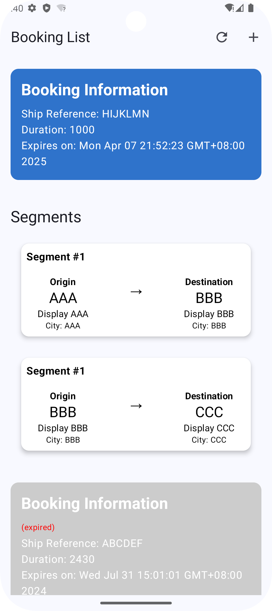
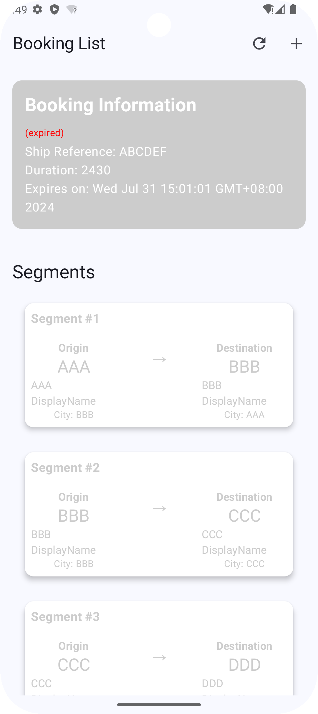

# mobileTest

## Architecture
1. **Service Layer**
   - `BookingService` interface defines the contract of fetching booking data by network
   - `MockBookingService` implementation simulate the network call by using JSON file as data source
2. **Cache Layer** 
   - `BookingCache` interface define the contract of handling local persistent storage
   - `MockBookingCache` implementation store data in SharedPreferences
3. **Data Manager Layer** 
   - `BookingDataProvider` Manager the data flow between Service and Cache, and provide interface for UI layer to fetch data
4. **UI Layer**
   - `BookingViewModel` as a bridge between UI and data manager, and provide booking state flow for UI
   - `BookingListScreen` observe data flow and change with it

## Key Features
1. Data caching and expiration
   - Cache data each time when fetching from network
   - Cache expires after 1 minutes (for testing)
2. Refresh mechanism
   - Manual refresh button
   - Click refresh button and fetch data from network
   - If network fails then show cache data
3. Error handling
   - Displays Error content and No Data content in UI
   - Result wrapper

## Screenshot
1. **Booking data**
 

2. **Expired booking data**
 

3. **Refreshing**

   <video width="200" height="" controls>
      <source src="./screenshot/Screen_recording_20250308_194306.mp4" type="video/mp4" ></source>
   </video>

4. **Adding Booking data**

   <video width="200" height="" controls>
      <source src="./screenshot/Screen_recording_20250308_194335.mp4" type="video/mp4" ></source>
   </video>
